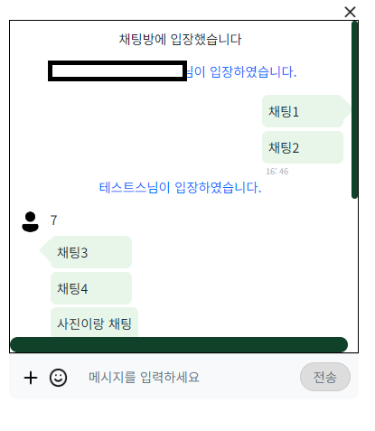
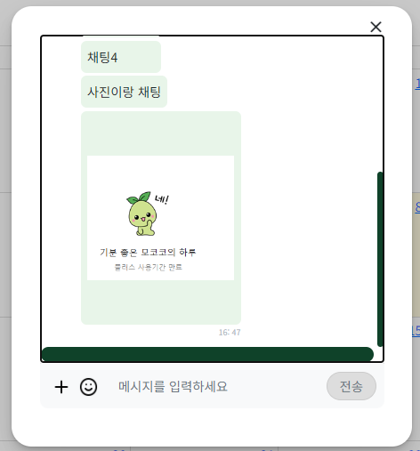

# 기존에 만들었던 Spring Legacy프로젝트를 리팩토링   SpringBoot, JPA 기타등등...

채팅기능
***
## * 구현 완료 기능 
### 1. 일반 채팅
### 2. 채팅 + 파일
### 3. 이전 채팅 목록 불러오기 
***
## * 미완성 & 수정 해야할 목록

### 1. HTML 디자인 (수정완료)
#### -> 카톡 처럼 한명이 여러번의 채팅을 쓸 경우 가장 위 채팅의 프로필 사진만 가져오지만   디자인 수정이 필요할듯 하다. 

### 2. 채팅없이 파일(사진)만 전송할 경우 전송되게하기 (수정완료)
#### -> 프론트단에서 보낼때 조건만 수정하면될것같다.

### 3. 세션관리 
#### -> 입장, 퇴장시 해당 메시지는 보내지만 예를들어 1번방에 몇명이있는지 같은걸 체크하고싶다.

### 4. 사진 미리보기 디자인
#### -> 파일 전송 전 사진을 미리 볼수있는 Preview를 만들었는데 디자인이 이상하다.

***

https://github.com/taeyeonimda/MyWeb/issues/3#issue-2450296093

